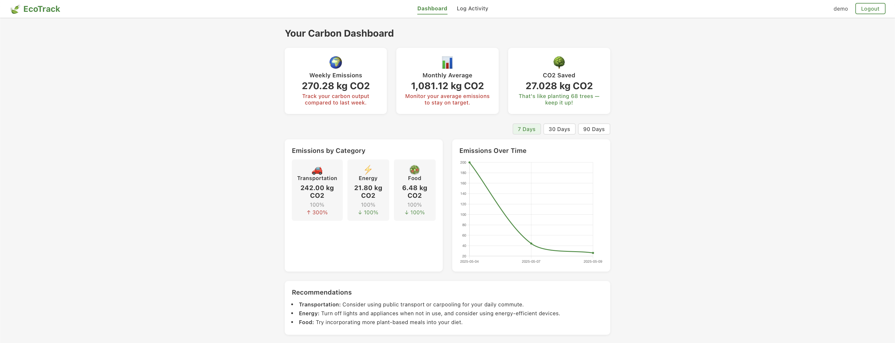

# EcoTrack - Carbon Footprint Tracking Application 🌱

EcoTrack helps you understand and reduce your carbon footprint by tracking your daily activities. Get personalized insights and recommendations to make sustainable choices! 🌍

## Features ✨
- Track daily activities: transportation, food, and energy use
- Visualize your carbon impact with dashboards and charts
- Get smart, actionable recommendations

---

## Screenshots 📸

### 🚪 Login & Register Page


---

### 📊 Dashboard


---

### 🍽️ Log Activity (Food Example)


---

## Get Started 🚀
1. Clone the repo
2. Install dependencies
3. Run the app

---

Contribute to a greener planet with EcoTrack! 🌳

## Project Structure

```
ecotrack/
├── backend/         # Node.js/Express backend
├── frontend/        # React frontend
└── README.md        # This file
```

## Features

- User authentication and profile management
- Activity logging with carbon footprint calculation
- Dashboard with visual analytics
- Goal setting and progress tracking
- Personalized recommendations
- Monthly reports and insights

## Tech Stack

### Backend
- Node.js
- Express.js
- MySQL
- JWT Authentication
- Sequelize ORM

### Frontend
- React.js
- Material-UI
- Chart.js for visualizations
- Axios for API calls

## Setup Instructions

### Prerequisites
- Node.js (v14 or higher)
- MySQL (v8.0 or higher)
- npm or yarn package manager

### Backend Setup
1. Navigate to the backend directory:
   ```bash
   cd backend
   ```

2. Install dependencies:
   ```bash
   npm install
   ```

3. Create a `.env` file with the following variables:
   ```
   DB_HOST=localhost
   DB_USER=your_username
   DB_PASSWORD=your_password
   DB_NAME=ecotrack
   JWT_SECRET=your_jwt_secret
   PORT=8080
   ```

4. Initialize the database:
   ```bash
   mysql -u your_username -p < db/schema.sql
   mysql -u your_username -p ecotrack < db/seed.sql
   ```

5. Start the server:
   ```bash
   npm start
   ```

### Frontend Setup
1. Navigate to the frontend directory:
   ```bash
   cd frontend
   ```

2. Install dependencies:
   ```bash
   npm install
   ```

3. Start the development server:
   ```bash
   npm start
   ```

## API Documentation

The backend API provides the following endpoints:

### Authentication
- POST /api/auth/register - Register a new user
- POST /api/auth/login - Login user
- GET /api/auth/profile - Get user profile

### Activities
- POST /api/activities - Log a new activity
- GET /api/activities - Get user's activities
- GET /api/activities/:id - Get specific activity

### Dashboard
- GET /api/dashboard/summary - Get user's carbon footprint summary
- GET /api/dashboard/goals - Get user's goals and progress

### Recommendations
- GET /api/recommendations - Get personalized recommendations

## Contributing

1. Fork the repository
2. Create your feature branch (`git checkout -b feature/AmazingFeature`)
3. Commit your changes (`git commit -m 'Add some AmazingFeature'`)
4. Push to the branch (`git push origin feature/AmazingFeature`)
5. Open a Pull Request

<div align="center">
  <strong>Made with ❤️ by Sarvagna</strong>
</div> 
